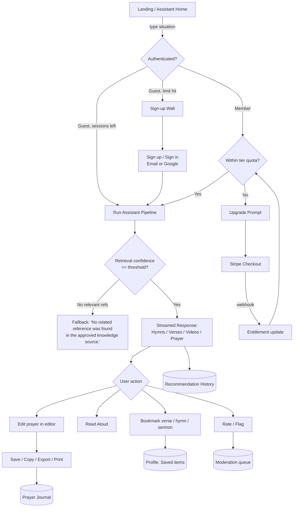
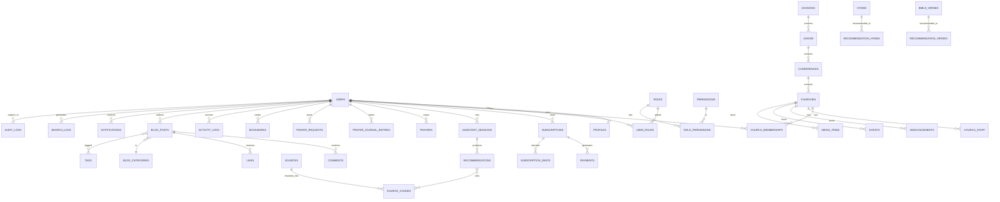
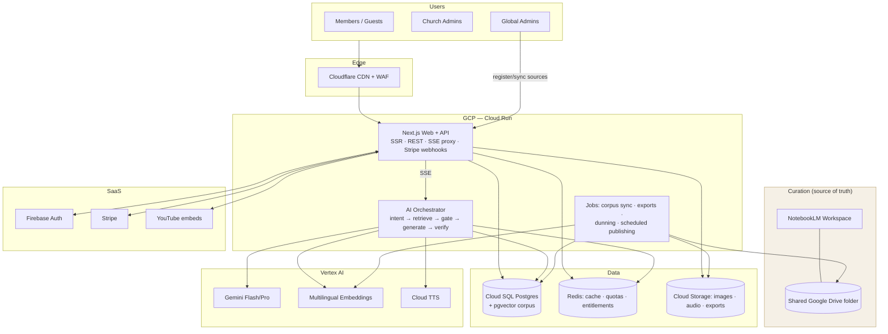

# Grace Companion — AI-Powered Spiritual Companion for SDA Members Worldwide
## Technical Planning Document & System Architecture — v1.0

> Prepared for immediate handoff to a development team. All sections are implementation-ready.
> Working title "Grace Companion" is a placeholder — rename freely.

---

## 1. Executive Summary

Grace Companion is a global, multilingual web application that serves Seventh-day Adventist (SDA) church members as a personal spiritual assistant. A member describes their situation ("I'm anxious", "I lost my job", "I want to thank God") and receives a curated spiritual response — SDA hymns (찬미가), Bible verses with explanations, sermon/worship videos, and an editable AI-generated prayer — **sourced exclusively from a trusted, admin-curated knowledge base managed in Google NotebookLM**. The AI is architecturally prevented from answering out of its own general knowledge: every recommendation must carry a citation into the approved corpus, and when no relevant reference exists the app responds with a polite fallback instead of hallucinating.

Around this core, the platform provides rich member profiles (prayer journal, saved verses/hymns/sermons, histories), church profiles (conference/union/division hierarchy, schedules, announcements, media), a premium blogging platform for paid members, a Stripe-powered subscription model (Free / Trial / Premium / Family / Organization), and a full admin console with analytics and moderation.

**Key architectural decisions (detailed later):**

| Decision | Choice | Why |
|---|---|---|
| Grounding strategy | NotebookLM as *curation workspace*; sources mirrored into an app-controlled RAG pipeline (Vertex AI RAG Engine + Gemini with grounded generation) | NotebookLM has no public consumer API; a mirrored corpus gives API access, citation enforcement, and confidence scoring while admins keep curating in NotebookLM |
| Hallucination prevention | Retrieval-gated generation: no retrieval hit above threshold → hard fallback message; every output claim must map to a retrieved chunk ID | Contractual requirement of the product |
| Stack | Next.js (App Router) + PostgreSQL (Cloud SQL) + Prisma + Firebase Auth + Vertex AI + Stripe, on Google Cloud Run | Relational requirements (subscriptions, RBAC, blogs) demand SQL; Google stack keeps NotebookLM/Vertex adjacency; team already knows Next.js/Firebase/Stripe |
| MVP | Spiritual Assistant + Auth + basic Profile + Free/Premium tiers | Fastest path to the differentiating feature |

---

## 2. Product Vision

**Vision statement.** *Every SDA member, anywhere in the world, at any moment of need, can receive trustworthy spiritual encouragement — drawn only from sources their church community has approved.*

**Problems it solves**
- Members in crisis reach for generic AI chatbots that mix doctrine-inconsistent or fabricated content into spiritual advice.
- Hymnal, Bible, sermon, and devotional resources are scattered; nothing personalizes them to a member's moment.
- Local churches lack an affordable digital presence tied to their global organizational structure (church → conference → union → division).

**Product principles**
1. **Trust over breadth.** A smaller, verified corpus beats an encyclopedic but unreliable one. "No related reference was found in the approved knowledge source" is a *feature*, not a failure.
2. **Cited, always.** Every hymn, verse, video, and prayer sentence traces to a NotebookLM-managed source.
3. **Member-owned data.** Prayer journals and histories are private by default; export and deletion are first-class (GDPR).
4. **Global by design.** Multilingual UI and corpus (English, Korean 찬미가, Spanish, Portuguese first), timezone-aware, low-bandwidth friendly.
5. **Church-shaped.** The SDA organizational hierarchy (Division → Union → Conference → Church) is a first-class data model, not a tag.

**Success metrics (year 1)**
- 50k registered members, 5% premium conversion, ≥ 60% of assistant sessions rated "helpful", < 0.5% of assistant responses flagged for doctrinal concern, NPS ≥ 50.

---

## 3. Functional Requirements

Requirements are numbered `FR-<module>-<n>`. Priority: **M**ust / **S**hould / **C**ould (MoSCoW).

### 3.1 Spiritual Assistant (SA)
| ID | Requirement | Priority |
|---|---|---|
| FR-SA-1 | User submits free-text situation/emotion/prayer request (min 2 chars, max 2,000) in any supported language | M |
| FR-SA-2 | System retrieves content **only** from the approved knowledge corpus (mirrored from NotebookLM) | M |
| FR-SA-3 | Response includes 1–3 SDA hymns: title, hymn number, hymnal edition (e.g., SDAH / 새찬미가), reason for recommendation, each with source citation | M |
| FR-SA-4 | Response includes 2–5 Bible verses: reference, verse text (licensed translation per language), explanation, situational relevance, citation | M |
| FR-SA-5 | Response includes 0–3 YouTube sermon/worship videos **only if the video URL exists in the corpus**; rendered as embedded player with title, speaker, source citation | M |
| FR-SA-6 | Response includes an AI-generated prayer composed strictly from retrieved reference language/themes; displayed in a rich text editor; user can edit, save, copy, export (PDF/DOCX/TXT), print | M |
| FR-SA-7 | If retrieval confidence < threshold for a component, that component is omitted; if all components fail, show exactly: *"No related reference was found in the approved knowledge source."* (localized) | M |
| FR-SA-8 | Read Aloud (TTS) for Bible verses, prayer, and hymn explanations; play/pause/speed controls; voice matches UI language | M |
| FR-SA-9 | If corpus contains audio references (e.g., hymn recordings, audio sermons), inline audio playback | S |
| FR-SA-10 | Every citation is tappable → shows source document title, snippet, and NotebookLM source ID | M |
| FR-SA-11 | User can rate a response (helpful / not helpful) and flag doctrinal concerns → moderation queue | M |
| FR-SA-12 | Full recommendation history saved to profile; user can re-open, delete entries | M |
| FR-SA-13 | Guests get 3 assistant sessions before sign-up wall; Free tier N/day; Premium unlimited (limits configurable) | M |
| FR-SA-14 | Streaming response UI (components appear as generated) | S |

### 3.2 Member Profile (MP)
| ID | Requirement | Priority |
|---|---|---|
| FR-MP-1 | Personal info: name, photo, birthday (optional), country, timezone, language preference | M |
| FR-MP-2 | Church membership: link to a Church profile; role in church (member/elder/pastor/etc., self-declared, church-admin verifiable) | M |
| FR-MP-3 | Spiritual interests + favorite Bible topics (taxonomy-driven multi-select, drives personalization) | S |
| FR-MP-4 | Favorite hymns, saved Bible verses, saved hymns, saved sermons (bookmark from any assistant response or church media) | M |
| FR-MP-5 | Prayer journal: private rich-text entries, tags, calendar view, answered-prayer marking | M |
| FR-MP-6 | Prayer requests: private, church-shared, or public; status open/answered/closed; others can "praying for you" (count) | S |
| FR-MP-7 | Histories: reading, listening, search, AI recommendations — viewable, individually deletable, bulk-clearable | M |
| FR-MP-8 | Notification settings (email/push per event type), privacy settings (profile visibility, history retention), language | M |
| FR-MP-9 | Full data export (JSON + PDF) and account deletion (GDPR Art. 15/17) | M |

### 3.3 Church Profile (CP)
| ID | Requirement | Priority |
|---|---|---|
| FR-CP-1 | Church record with name, Conference, Union, Division (from seeded SDA org hierarchy), country, language(s) | M |
| FR-CP-2 | Staff: pastors, elders, departments (name, leader, contact) | M |
| FR-CP-3 | Service schedule (recurring, timezone-aware), location (map embed), contact info | M |
| FR-CP-4 | Announcements & events (create/edit by Church Admin; members auto-notified per settings) | M |
| FR-CP-5 | Sermon library + media library (video links incl. YouTube channel sync, audio, documents) | S |
| FR-CP-6 | Church blog (Church Admin authored, same engine as member blogs) | S |
| FR-CP-7 | Members can search/browse churches and request to join; Church Admin approves | M |
| FR-CP-8 | Church claiming flow: unclaimed seeded churches can be claimed with verification by Global Admin | S |

### 3.4 Blogging Platform (BL) — Premium members + Church Admins
| ID | Requirement | Priority |
|---|---|---|
| FR-BL-1 | Rich text editor with Markdown support (WYSIWYG ↔ MD toggle), image upload (max 10 MB, auto-optimized) | M |
| FR-BL-2 | Categories (admin-managed taxonomy) + free tags; drafts; scheduled publishing | M |
| FR-BL-3 | Comments (registered members; threaded 2 levels), likes, bookmarks | M |
| FR-BL-4 | Search (title/body/tags), SEO metadata (slug, meta description, OG image), sitemap + RSS | M |
| FR-BL-5 | Author profile page, reading statistics (views, read time, likes over time) for authors | S |
| FR-BL-6 | Featured posts (curated by Global Admin), admin moderation (pre-publish review optional per policy; post-publish flag queue mandatory) | M |
| FR-BL-7 | Losing premium status: existing posts stay published, creation disabled | M |

### 3.5 Subscriptions (SB)
| ID | Requirement | Priority |
|---|---|---|
| FR-SB-1 | Tiers: Free, Trial (14-day, card-optional), Premium (monthly/annual), Family (up to 6 members, one payer), Organization (church-level, future) | M |
| FR-SB-2 | Stripe Checkout + Billing Portal; webhooks drive entitlement state | M |
| FR-SB-3 | Billing history, invoices (Stripe-hosted), renewals, proration, cancellation (end-of-period) | M |
| FR-SB-4 | Coupons/promo codes (Stripe Coupons), regional pricing (Stripe multi-currency) | S |
| FR-SB-5 | Feature gating via a single server-side entitlement service; UI shows upgrade prompts on gated features | M |
| FR-SB-6 | Grace period on failed payment (7 days, dunning emails) before downgrade | M |

### 3.6 Admin (AD)
| ID | Requirement | Priority |
|---|---|---|
| FR-AD-1 | Dashboard: DAU/MAU, sessions, assistant usage, subscription MRR/churn, fallback rate, flag queue size | M |
| FR-AD-2 | User management: search, view, suspend, role assignment, GDPR delete/export | M |
| FR-AD-3 | Church management: CRUD, claim approvals, hierarchy editing | M |
| FR-AD-4 | Content management: hymn index, Bible translation config, taxonomy editing | M |
| FR-AD-5 | **NotebookLM source management**: register sources, trigger/monitor corpus sync, view sync diffs, retire sources, test retrieval console | M |
| FR-AD-6 | Blog moderation (flag queue, takedown with reason, author notification) | M |
| FR-AD-7 | Prayer analytics (volumes, topics — aggregated/anonymized only) and search analytics (top queries, zero-result queries) | S |
| FR-AD-8 | System logs + audit logs viewer (who did what, filterable) | M |
| FR-AD-9 | Role management: assign Church Admin / Global Admin; permission matrix view | M |

### 3.7 Roles summary
| Role | Capabilities |
|---|---|
| Guest | Browse public church pages & public blogs; 3 trial assistant sessions |
| Registered Member (Free) | Assistant (rate-limited), full profile, join church, comment/like/bookmark |
| Premium Member | Unlimited assistant, blogging, TTS export, family plan owner |
| Church Administrator | All member abilities + manage own church profile, announcements, events, media, church blog, approve members |
| Global Administrator | Everything, incl. NotebookLM sources, moderation, roles, analytics |

---

## 4. Non-functional Requirements

| Category | Requirement |
|---|---|
| Performance | Assistant first-token < 3 s p95; full response < 15 s p95. Page TTFB < 500 ms p95 (cached public pages < 100 ms via CDN). |
| Availability | 99.9% for app; assistant degrades gracefully (queue + retry) if AI layer is down, with honest status message. |
| Scalability | 100k MAU / 5k concurrent at launch architecture; horizontal scale to 1M MAU without re-architecture (see §19). |
| Internationalization | UI: en, ko, es, pt at launch; all strings externalized (ICU MessageFormat); corpus is per-language; RTL-ready CSS. |
| Accessibility | WCAG 2.2 AA; TTS complements, never replaces, accessible text; full keyboard nav; captions required for embedded video where available. |
| Privacy | GDPR + CCPA; prayer content encrypted at rest with app-layer encryption (see §18); analytics on spiritual content only in aggregate. |
| Compliance | Bible translation licensing per language (e.g., KJV public domain; others licensed); hymnal copyright review per edition; YouTube embeds via official iframe API only (no downloads). |
| Data retention | Histories default 24 months (user-configurable); logs 90 days; audit logs 7 years. |
| Cost | AI cost per assistant session budgeted < $0.03 at Free tier via caching + small-model routing (see §13.7). |
| Observability | Distributed tracing on the full assistant pipeline; per-component (hymn/verse/video/prayer) success metrics. |

---

## 5. User Personas

**P1 — "Grace" Kim, 58, Seoul (Korean).** Deaconess, 30-year member. Uses the app after evening news makes her anxious; wants 찬미가 recommendations with hymn numbers she can play on piano, large fonts, Korean TTS. Free tier; pays for nothing online but her daughter may gift Family plan. *Needs: Korean corpus, simplicity, trust.*

**P2 — Daniel Osei, 27, Accra (English).** Young professional, active in youth ministry, just lost his job. Types long emotional messages at midnight. Listens to responses via TTS during commutes on 3G. Likely Premium if trial wins him. *Needs: fast on low bandwidth, prayer he can edit and save, sermon videos.*

**P3 — Pr. Maria Santos, 45, São Paulo (Portuguese).** District pastor over 3 churches → **Church Administrator**. Manages announcements, service schedules, sermon uploads for each church; wants member join-approvals and event notifications. *Needs: multi-church admin, low-effort content tools, church blog.*

**P4 — Elder James Whitfield, 63, Sydney (English).** Premium member and lay theologian. Writes weekly blog posts; cares about SEO, drafts, scheduling, and reading stats. First to flag any AI answer that "doesn't sound Adventist." *Needs: serious editor, moderation transparency, citation inspection.*

**P5 — Sarah Lindqvist, 34, Global Admin (staff).** Manages the NotebookLM corpus with a doctrinal review committee. Needs sync visibility, zero-result query reports (to find corpus gaps), and a retrieval test console. *Needs: admin console power, audit trails.*

---

## 6. User Journey

**Primary journey — "Moment of need" (Daniel, P2):**

1. **Trigger.** Midnight; anxious after job loss. Opens app (PWA icon) → lands on Assistant home: single prompt box, "How is your heart today?"
2. **Express.** Types "I lost my job today and I'm scared for my family." Presses Ask.
3. **Receive.** Streaming response: 2 hymns ("Trust and Obey" #590, with reason + citation) → 3 verses (Matt 6:25-34 with explanation) → 1 embedded sermon video (from corpus) → generated prayer in editor. Each block shows a small "source" chip.
4. **Engage.** Edits the prayer to add his family's names. Taps Read Aloud; listens. Saves prayer to journal; bookmarks a verse.
5. **Deepen.** Prompt: "Want to keep this in your Prayer Journal and get a follow-up verse on Sabbath?" → signs up (was guest) with Google → journal saved, history begins.
6. **Return.** Sabbath push notification with saved content. After 5 sessions in a week, hits Free daily limit → sees Trial offer → starts 14-day trial.
7. **Convert.** Trial day 12 email shows his stats ("8 prayers saved, 21 verses"). Converts to Premium annual with a regional-price coupon.

**Secondary journeys:** Maria (P3) claims her church → sets schedule → posts announcement → members notified. James (P4) drafts post Tuesday → schedules for Sabbath → reviews stats Sunday. Sarah (P5) reviews weekly zero-result queries → adds 3 documents in NotebookLM → registers them in admin → triggers sync → verifies in retrieval console.

---

## 7. User Flow Diagram



---

## 8. Information Architecture

```
/                         Assistant home (the product IS the homepage)
/assistant/history        Past sessions
/bible                    Saved verses, verse browser (corpus-backed)
/hymns                    Saved hymns, hymn index (SDAH / 새찬미가)
/journal                  Prayer journal (private)
/prayer-requests          Mine + church + public walls
/churches                 Directory & search
/churches/[slug]          Church profile (public)
/churches/[slug]/admin    Church admin console (guarded)
/blog                     Blog home (featured, categories, search)
/blog/[authorSlug]/[postSlug]
/blog/write               Editor (premium-guarded)
/me                       Profile hub
/me/settings              Personal, notifications, privacy, language
/me/subscription          Plan, billing portal link, history
/pricing                  Tiers + trial CTA
/auth/*                   Sign in / up / reset
/admin                    Global admin (role-guarded)
  /admin/users /admin/churches /admin/content
  /admin/sources          NotebookLM source management + sync + test console
  /admin/moderation /admin/analytics /admin/logs /admin/roles
```

Navigation: bottom tab bar on mobile (Assistant · Journal · Churches · Blog · Me); left rail on desktop. Admin surfaces are separate route groups with server-side guards.

---

## 9. System Architecture

```mermaid
flowchart LR
    subgraph Client
        W[Next.js Web App / PWA]
    end
    subgraph Edge
        CDN[Cloudflare CDN + WAF]
    end
    subgraph GCP["Google Cloud (primary region + read replicas)"]
        FE[Cloud Run: Next.js SSR/API]
        AI[Cloud Run: AI Orchestrator service]
        SYNC[Cloud Run Jobs: Corpus Sync worker]
        Q[(Cloud Tasks / PubSub)]
        PG[(Cloud SQL PostgreSQL + pgvector or Vertex Vector Search)]
        RD[(Memorystore Redis: cache, rate limits, sessions-adjacent)]
        GCS[(Cloud Storage: images, exports, audio)]
        VAI[Vertex AI: Gemini generate + embeddings + TTS]
        SEC[Secret Manager]
        LOG[Cloud Logging / Monitoring / Trace]
    end
    subgraph External
        NLM[NotebookLM Workspace\n(curation source of truth)]
        DRV[Google Drive/Docs\n(source documents)]
        STR[Stripe]
        FBA[Firebase Auth]
        YT[YouTube iframe embeds]
    end
    W --> CDN --> FE
    FE <--> FBA
    FE --> PG & RD & GCS
    FE -->|assistant request| AI
    AI --> PG & RD & VAI
    FE <-->|checkout/webhooks| STR
    SYNC <--> DRV
    NLM -.same sources.-> DRV
    SYNC --> PG & VAI & Q
    FE --> YT
    FE & AI & SYNC --> SEC & LOG
```

**Service responsibilities**
- **Next.js app (Cloud Run):** SSR pages, REST API routes, entitlement checks, Stripe webhooks. Stateless; scales horizontally.
- **AI Orchestrator (separate Cloud Run service):** the entire assistant pipeline (§13). Isolated so AI latency/cost scaling doesn't affect page serving; internal-only ingress; called via authenticated service-to-service requests; streams via SSE through the Next.js proxy.
- **Corpus Sync worker (Cloud Run Jobs):** mirrors registered source documents (shared with NotebookLM via Google Drive) into the app corpus: fetch → parse → chunk → embed → upsert (§14).
- **PostgreSQL:** system of record for everything relational; **pgvector** for embeddings at MVP scale (swap to Vertex AI Vector Search past ~5M chunks).
- **Redis:** response cache (query-similarity cache), rate limiting, hot entitlements.
- **Firebase Auth:** identity (email/password + Google); verified ID tokens exchanged server-side; roles live in PostgreSQL, mirrored to custom claims for fast checks.

---

## 10. Database ER Diagram



---

## 11. Database Tables

PostgreSQL 16. All tables: `id UUID PK DEFAULT gen_random_uuid()`, `created_at`, `updated_at TIMESTAMPTZ`. Only distinctive columns listed. `--` marks notes.

**Identity & RBAC**
- `users` — firebase_uid UNIQUE, email UNIQUE, email_verified, status(active|suspended|deleted), last_seen_at
- `profiles` — user_id FK UNIQUE, display_name, photo_url, country, timezone, language(en|ko|es|pt), birthday DATE NULL, spiritual_interests TEXT[], favorite_bible_topics TEXT[], privacy JSONB, notification_prefs JSONB, history_retention_months INT DEFAULT 24
- `roles` — name UNIQUE (guest|member|premium|church_admin|global_admin) -- premium is entitlement-derived but materialized for fast RBAC
- `permissions` — key UNIQUE (e.g., blog.create, church.manage, admin.sources)
- `role_permissions` — role_id, permission_id, UNIQUE(role_id, permission_id)
- `user_roles` — user_id, role_id, scope_church_id NULL -- church_admin scoped to a church; UNIQUE(user_id, role_id, scope_church_id)

**SDA hierarchy & churches**
- `divisions` / `unions` (division_id FK) / `conferences` (union_id FK) — name, code, country
- `churches` — conference_id FK, slug UNIQUE, name, country, languages TEXT[], location JSONB(lat,lng,address), contact JSONB, service_schedule JSONB, youtube_channel_url, website, is_claimed BOOL, claimed_by NULL FK users
- `church_staff` — church_id, user_id NULL, name, role(pastor|elder|dept_leader), department NULL, contact JSONB
- `church_memberships` — church_id, user_id, status(pending|active|removed), church_role TEXT NULL, verified_by NULL, UNIQUE(church_id, user_id)
- `announcements` — church_id, author_id, title, body_richtext JSONB, publish_at, pinned BOOL
- `events` — church_id, title, description, starts_at, ends_at, location JSONB, rrule TEXT NULL
- `media_items` — church_id NULL, type(sermon_video|audio|document|image), title, speaker NULL, url, storage_path NULL, source_id NULL FK sources -- corpus-linked sermons

**Knowledge corpus (mirror of NotebookLM sources)**
- `sources` — notebooklm_source_ref TEXT, drive_file_id TEXT NULL, title, type(hymnal|bible_commentary|devotional|sermon_transcript|video_ref|audio_ref|doc), language, license_note, status(active|retired|pending_sync), checksum, last_synced_at, added_by FK users
- `source_chunks` — source_id FK, chunk_index INT, content TEXT, token_count INT, embedding VECTOR(768), metadata JSONB(hymn_no, verse_ref, video_url, timestamps, page), UNIQUE(source_id, chunk_index) -- HNSW index on embedding
- `hymns` — hymnal_edition(SDAH|KOR_2015|...), number INT, title, themes TEXT[], audio_source_id NULL, UNIQUE(hymnal_edition, number)
- `bible_verses` — translation, book, chapter INT, verse_start INT, verse_end INT, text, language -- licensed text cache; UNIQUE on (translation, book, chapter, verse_start, verse_end)

**Assistant**
- `assistant_sessions` — user_id NULL (guest hash), query_text, query_language, status(ok|fallback|error), confidence NUMERIC, latency_ms INT, model, cost_usd NUMERIC
- `recommendations` — session_id FK, kind(hymn|verse|video|prayer), payload JSONB, confidence NUMERIC, user_rating SMALLINT NULL, flagged BOOL DEFAULT false, flag_reason NULL
- `recommendation_citations` — recommendation_id FK, source_chunk_id FK, relevance NUMERIC
- `recommendation_hymns` — recommendation_id FK, hymn_id FK; `recommendation_verses` — recommendation_id FK, bible_verse_id FK
- `prayers` — user_id, session_id NULL, title, body_richtext JSONB, body_plain TEXT, is_encrypted BOOL -- app-layer encrypted at rest (§18)
- `prayer_journal_entries` — user_id, entry_date DATE, body_richtext JSONB (encrypted), tags TEXT[], answered_at NULL
- `prayer_requests` — user_id, church_id NULL, visibility(private|church|public), title, body (encrypted when private), status(open|answered|closed), praying_count INT DEFAULT 0

**Engagement**
- `bookmarks` — user_id, target_type(verse|hymn|sermon|blog_post|prayer), target_id UUID, UNIQUE(user_id, target_type, target_id)
- `activity_logs` — user_id, type(read|listen|search|recommendation_view), target_type, target_id NULL, metadata JSONB -- partitioned monthly; feeds histories
- `search_logs` — user_id NULL, query, language, result_count INT, was_fallback BOOL -- feeds zero-result analytics
- `notifications` — user_id, type, title, body, link, channel(inapp|email|push), read_at NULL, sent_at

**Blog**
- `blog_categories` — slug UNIQUE, name, sort INT
- `blog_posts` — author_id, church_id NULL (church blogs), category_id, slug, title, body_richtext JSONB, body_md TEXT, excerpt, cover_image_url, seo JSONB(meta_description, og_image), status(draft|scheduled|published|removed), publish_at, featured BOOL, view_count INT, read_seconds_est INT, UNIQUE(author_id, slug)
- `tags` — slug UNIQUE, name; `blog_post_tags` — post_id, tag_id
- `comments` — post_id, author_id, parent_id NULL, body, status(visible|hidden|removed)
- `likes` — user_id, post_id, UNIQUE(user_id, post_id)

**Billing**
- `subscription_plans` — code(free|trial|premium_monthly|premium_annual|family|org), stripe_price_id, features JSONB, max_seats INT
- `subscriptions` — owner_user_id, plan_id, stripe_customer_id, stripe_subscription_id, status(trialing|active|past_due|canceled|expired), current_period_end, cancel_at_period_end BOOL, coupon_code NULL
- `subscription_seats` — subscription_id, user_id, UNIQUE(subscription_id, user_id) -- family members
- `payments` — subscription_id, stripe_invoice_id, amount_cents, currency, status(paid|failed|refunded), paid_at

**Ops**
- `audit_logs` — actor_user_id NULL, action, target_type, target_id, before JSONB NULL, after JSONB NULL, ip INET, user_agent -- append-only, 7y retention
- `system_jobs` — type(corpus_sync|export|dunning), status, payload JSONB, started_at, finished_at, error NULL

---

## 12. API Design

REST, versioned `/api/v1`. Auth: `Authorization: Bearer <Firebase ID token>`; server verifies and loads roles/entitlements. Standard envelope `{ data, error, meta }`; cursor pagination (`?cursor=&limit=`); errors as RFC 9457 problem+json. 🔒 = auth required, 👑 = premium, ⛪ = church_admin (scoped), 🛡 = global_admin.

**Auth & session**
```
POST /auth/session            exchange Firebase ID token → app session context (roles, entitlements)
POST /auth/signout
GET  /me                      🔒 current user + profile + entitlements
```
**Profile**
```
GET/PATCH /me/profile         🔒
GET/PATCH /me/settings        🔒 notifications, privacy, language
GET  /me/history?type=reading|listening|search|recommendation   🔒
DELETE /me/history/:id | /me/history?type=...                   🔒
POST /me/export               🔒 async GDPR export → notification with signed URL
DELETE /me/account            🔒 soft-delete + 30-day purge job
```
**Assistant**
```
POST /assistant/sessions      🔒(or guest token)  { text, language }
                              → SSE stream: events hymns|verses|videos|prayer|fallback|done
GET  /assistant/sessions      🔒 history (paginated)
GET  /assistant/sessions/:id  🔒
POST /assistant/sessions/:id/rating   🔒 { rating | flag_reason }
GET  /assistant/quota         🔒 remaining sessions today
```
**Prayers & journal**
```
GET/POST /prayers             🔒   GET/PATCH/DELETE /prayers/:id  🔒
POST /prayers/:id/export      🔒 { format: pdf|docx|txt }
GET/POST /journal             🔒   PATCH/DELETE /journal/:id      🔒
GET/POST /prayer-requests     🔒 (GET public wall allows guest)
POST /prayer-requests/:id/pray 🔒 increment praying_count
```
**Bible & hymns**
```
GET /bible/search?q=&translation=      corpus-backed verse search
GET /bible/verses/:ref                 e.g. /bible/verses/john.3.16?translation=KJV
GET /hymns?edition=&q=&theme=          hymn index
GET /hymns/:edition/:number
POST /bookmarks  🔒  { target_type, target_id }    DELETE /bookmarks/:id 🔒
GET  /bookmarks?type= 🔒
```
**TTS**
```
POST /tts  🔒  { text, language, voice? } → audio URL (cached by content hash)
```
**Churches**
```
GET  /churches?q=&country=&conference=     directory search
GET  /churches/:slug                        public profile
POST /churches/:slug/join                  🔒
POST /churches/:slug/claim                 🔒 → admin approval queue
⛪ PATCH /churches/:slug
⛪ GET/POST/PATCH/DELETE /churches/:slug/announcements[/:id]
⛪ /churches/:slug/events[/:id]  ⛪ /churches/:slug/media[/:id]  ⛪ /churches/:slug/staff[/:id]
⛪ GET/PATCH /churches/:slug/members[/:userId]   approve/remove
```
**Blog**
```
GET  /blog/posts?category=&tag=&q=&author=&featured=
GET  /blog/posts/:authorSlug/:postSlug
👑 POST /blog/posts        👑 PATCH/DELETE /blog/posts/:id
👑 POST /blog/uploads      signed URL for images
GET/POST /blog/posts/:id/comments 🔒   PATCH/DELETE /comments/:id 🔒(own)
POST/DELETE /blog/posts/:id/like 🔒
👑 GET /blog/posts/:id/stats
```
**Subscriptions**
```
GET  /plans
POST /subscriptions/checkout   🔒 { plan_code, coupon? } → Stripe Checkout URL
POST /subscriptions/portal     🔒 → Stripe Billing Portal URL
GET  /subscriptions/me         🔒 status + seats + payments
POST /subscriptions/seats      🔒 owner invites family member (email)
POST /webhooks/stripe          Stripe signature-verified; no auth header
```
**Admin (🛡 unless noted)**
```
GET /admin/metrics/overview                    dashboard KPIs
GET/PATCH /admin/users[/:id]                   search, suspend, roles
GET/POST/PATCH /admin/churches[/:id]           incl. claim approvals
GET/POST/PATCH /admin/sources[/:id]            register/retire NotebookLM sources
POST /admin/sources/sync                       trigger corpus sync (async job)
GET  /admin/sources/sync/:jobId                sync status + diff report
POST /admin/sources/test-retrieval             { query } → chunks + scores (test console)
GET/PATCH /admin/moderation/flags[/:id]        assistant + blog + comment flags
GET  /admin/analytics/prayer|search|subscriptions
GET  /admin/logs?type=audit|system
GET/POST/DELETE /admin/roles/assignments
```

---

## 13. AI Workflow

### 13.1 Pipeline overview

```mermaid
flowchart TD
    Q[User query] --> PRE[1. Preprocess:\nlanguage detect, PII scrub for logs,\nsafety screen, quota check]
    PRE --> INT[2. Intent & need analysis\n(small model, structured output):\nemotion, situation, request-type,\nretrieval queries per component]
    INT --> CACHE{3. Similar-query\ncache hit?}
    CACHE -->|yes| RESP
    CACHE -->|no| RET[4. Hybrid retrieval per component:\nvector (pgvector) + BM25 + metadata filters\n(language, type=hymnal/sermon/video...)]
    RET --> RANK[5. Cross-encoder re-rank\n+ confidence scoring]
    RANK --> GATE{6. Confidence gate\nper component}
    GATE -->|all below floor| FB[Fallback message]
    GATE -->|some pass| GEN[7. Grounded generation (Gemini):\ncontext = ONLY retrieved chunks,\nstructured JSON output with\nmandatory chunk-ID citations]
    GEN --> VER[8. Verification pass:\n- every citation ID exists in retrieved set\n- hymn numbers/verse refs match corpus rows\n- video URLs exist in corpus\n- claim-support entailment check]
    VER -->|violation| REP{repairable?}
    REP -->|regenerate once| GEN
    REP -->|no| DROP[drop offending component]
    VER --> RESP[9. Stream response + persist\nsession, recommendations, citations]
    DROP --> RESP
```

### 13.2 How queries are processed
1. **Preprocess.** Detect language (query may differ from UI language); strip PII before anything is written to `search_logs`; run safety screen — self-harm signals trigger a special supportive template **plus** localized crisis resources (this template is the one deliberate exception to corpus-only, reviewed by the doctrinal committee and stored as approved static content).
2. **Intent analysis.** A small fast model (Gemini Flash) produces structured JSON: `{ emotions[], situation, request_type: comfort|guidance|gratitude|intercession, retrieval_queries: { hymns: [...], verses: [...], videos: [...] } }`. Component-specific queries beat one generic query (hymn themes ≠ verse topics).

### 13.3 How the corpus is queried & references retrieved
- **Hybrid retrieval** per component: cosine similarity on `source_chunks.embedding` (Vertex `text-multilingual-embedding` — one space across en/ko/es/pt) **plus** Postgres full-text BM25, merged with Reciprocal Rank Fusion. Metadata filters: `language`, `source.type` (hymnal for hymns, video_ref for videos), `status='active'`.
- Top-20 fused candidates → **cross-encoder re-rank** → top 3–6 chunks per component with scores.

### 13.4 How citations are preserved
- Every retrieved chunk carries an immutable `source_chunk_id`. The generation prompt requires structured JSON where **each item and each prayer paragraph includes `citation_chunk_ids: []`**.
- The verifier rejects any ID not in the retrieved set (prevents fabricated citations). Persisted to `recommendation_citations`; the UI renders source chips resolving to `sources.title` + snippet + `notebooklm_source_ref`, so admins can trace any output back to the NotebookLM workspace document.

### 13.5 How the prayer is generated
- Prompt contract: *"Compose a prayer for this person using ONLY the themes, promises, and language present in the reference excerpts below. You may address the person's stated situation and use natural connective prose, but every spiritual claim, promise, or scriptural allusion must come from an excerpt and cite it. Do not introduce doctrines, verses, or promises not present in the excerpts."*
- Output: paragraphs with per-paragraph citations. The entailment check (§13.6) validates spiritual claims against cited chunks. Delivered into the rich text editor; subsequent user edits are the user's own content (original AI version retained immutably for auditability).

### 13.6 How hallucination is prevented (defense in depth)
1. **Retrieval gating** — generation never runs without passing chunks; no chunks → fallback. The model cannot answer from parametric knowledge because it is never asked an open question.
2. **Closed-context prompting** — system prompt forbids external knowledge; context window contains only retrieved chunks + user situation; temperature 0.3.
3. **Structural verification** — hymn numbers and verse references in output are joined against `hymns` / `bible_verses` rows; mismatch → drop or repair. Video URLs must equal a corpus `video_ref` URL exactly (never model-generated).
4. **Citation verification** — every cited chunk ID must be in the retrieved set (§13.4).
5. **Entailment check** — a second cheap model call scores "is this sentence supported by its cited excerpt?" per spiritual claim; unsupported → one regeneration attempt, then drop the component.
6. **Human loop** — user flags → moderation queue; sampled sessions (1%) get committee review; failures feed prompt/threshold tuning.

### 13.7 How confidence is measured
- Per component: `confidence = w1·max_rerank_score + w2·mean_top3_score + w3·retrieval_agreement (vector∩BM25 overlap)`, normalized 0–1.
- Thresholds (initial, tuned via labeled evals): **≥ 0.70** include; **0.55–0.70** include with "closest match" framing; **< 0.55** omit component. Session-level confidence stored on `assistant_sessions` for analytics.
- Weekly offline eval set (≥ 200 labeled queries per language) regression-tests thresholds before any prompt/model change ships.

### 13.8 Fallback behavior
- All components below floor → exact localized message: *"No related reference was found in the approved knowledge source."* + gentle suggestions (rephrase; browse hymn index; write in journal). Never a partial hallucinated answer.
- Partial success → show passing components; omit others silently (no apology spam).
- AI layer outage → honest status message + retry; the query is preserved in the input box.
- Every fallback logs to `search_logs.was_fallback` → admin "corpus gap" report (§13.6 human loop closes the gap by adding sources).

---

## 14. NotebookLM Integration

**Reality check (drives the whole design):** consumer NotebookLM has **no public API** for programmatic querying. Building the runtime directly on NotebookLM is not currently possible; screen-automation is fragile and violates ToS. The strategy below keeps NotebookLM as the **human curation layer** while the app owns a faithful, synced mirror for runtime retrieval. If the organization adopts **NotebookLM Enterprise (Google Agentspace)**, which exposes managed API access, the retrieval adapter can be swapped without touching the rest of the pipeline — the orchestrator depends on a `KnowledgeRetriever` interface, not a vendor.

**Architecture: "Curate in NotebookLM, serve from the mirror"**

1. **Single source of truth for curation.** The doctrinal committee manages sources in the NotebookLM workspace (to be provided at implementation). Every source lives in a shared **Google Drive folder** (Docs/PDFs/transcripts) that NotebookLM imports from — Drive is the programmatic access point.
2. **Registration.** In `/admin/sources`, an admin registers each NotebookLM source with its Drive file ID, type (hymnal / commentary / sermon transcript / video_ref / audio_ref), language, and license note. Video/audio sources are registered as reference documents containing the URL + transcript/description; **only URLs present in these documents are ever embedded/played**.
3. **Sync job** (Cloud Run Job, on-demand + nightly): Drive API fetch → checksum compare → parse (Docs API / PDF extraction) → structure-aware chunking (hymns: one chunk per hymn with `hymn_no` metadata; commentary: per-pericope with `verse_ref`; transcripts: per-segment with timestamps) → embed (Vertex multilingual) → upsert `source_chunks` → mark `sources.last_synced_at`. Produces a **diff report** (added/changed/removed chunks) for admin review.
4. **Drift control.** Weekly reconciliation flags Drive files not registered in the app and registered sources missing from Drive; admin dashboard shows sync freshness per source. Retiring a source (`status='retired'`) immediately excludes its chunks via the retrieval filter — no re-index needed.
5. **Verification console.** `/admin/sources/test-retrieval` lets curators run a query and inspect exactly which chunks (and scores) the runtime would use — the trust bridge between "what's in NotebookLM" and "what the app says."
6. **Provenance guarantee.** `sources.notebooklm_source_ref` ties every runtime citation back to the workspace document, satisfying "every recommendation originates from the NotebookLM knowledge source" with an auditable chain: NotebookLM doc → Drive file → source row → chunk → citation → rendered chip.

---

## 15. Subscription Architecture

**Tiers & gating**

| Feature | Free | Trial (14d) | Premium | Family (≤6) | Org (future) |
|---|---|---|---|---|---|
| Assistant sessions/day | 3 | Unlimited | Unlimited | Unlimited | Pooled |
| Prayer save/export | Save only | Full | Full | Full | Full |
| TTS minutes/day | 10 | Unlimited | Unlimited | Unlimited | Pooled |
| Blogging | — | ✓ | ✓ | ✓ (each member) | ✓ |
| Journal & bookmarks | ✓ | ✓ | ✓ | ✓ | ✓ |

**Design**
- **Stripe owns money; the app owns entitlements.** Products/Prices in Stripe map to `subscription_plans.stripe_price_id`. Checkout via Stripe Checkout; self-service via Billing Portal (payment methods, cancellation, invoices) — the app never touches card data (SAQ-A scope).
- **Webhook-driven state machine** (`checkout.session.completed`, `customer.subscription.updated/deleted`, `invoice.paid`, `invoice.payment_failed`): webhooks are signature-verified, idempotent (event ID dedupe table), and update `subscriptions.status` → recompute entitlements → invalidate Redis entitlement cache → mirror `premium` role claim.
- **Entitlement service** — a single server-side function `can(user, feature)` consulted by API routes and SSR; reads Redis-cached entitlement blob (TTL 5 min + explicit invalidation). No client-side gating decisions ever trusted.
- **Trial:** card-optional trial via app-managed `trialing` state (no Stripe object until conversion) → higher trial starts; day-10/13 conversion emails.
- **Family:** one Stripe subscription (quantity=1, family price); owner invites emails → `subscription_seats`; seat-holders receive premium entitlements; removing a seat is immediate.
- **Dunning:** `past_due` → 7-day grace with banner + Stripe Smart Retries + emails → downgrade to Free (data preserved, creation gated).
- **Coupons & regional pricing:** Stripe Coupons/Promotion Codes; currency-specific Prices (KRW, BRL, GHS…) selected by profile country.

---

## 16. Blog Architecture

- **Editor:** TipTap (ProseMirror) storing canonical JSON in `blog_posts.body_richtext`, with Markdown import/export (`body_md`) for the MD-preferring authors. Same editor component powers prayers, journal, and announcements (one investment, four surfaces).
- **Images:** direct-to-GCS signed-URL upload → async job generates responsive variants (AVIF/WebP) → served via CDN.
- **Publishing:** `draft → scheduled(publish_at) → published`; Cloud Scheduler sweeps scheduled posts each minute. Slugs immutable after first publish (SEO); edits allowed with `updated_at` shown.
- **Rendering & SEO:** public post pages are SSG/ISR (revalidate on publish/edit) → CDN-cached, fast, crawlable. Per-post meta description, OG image (auto-generated card fallback), JSON-LD `Article`, per-author RSS, global sitemap.
- **Engagement:** threaded comments (2 levels, registered members), likes, bookmarks; view counting via beacon endpoint (deduped per user/day); author stats page (views, read-time estimate, likes over time).
- **Search:** Postgres FTS (title/body/tags) at MVP; upgrade path to Typesense if needed.
- **Moderation:** post-publish flag queue (any member can flag); Global Admin hide/remove with reason → author notification; optional per-policy pre-publish review switch for new authors; automated screens (spam links, banned terms) at save time.
- **Entitlement edge:** premium lapse → existing posts remain, editor gated (FR-BL-7).

---

## 17. Admin Architecture

- **Surface:** `/admin` route group in the same Next.js app (separate layout, server-side role guard on every route + API), deployable later as a separate app if teams split.
- **Dashboard:** KPI cards (DAU/MAU, sessions, fallback rate, MRR, churn, trial conversion, flag backlog) + trend charts; data from nightly-rolled-up `analytics_daily` materialized views (never live-scanning hot tables).
- **Modules:** Users (search/suspend/roles/GDPR actions) · Churches (CRUD, hierarchy, claim approvals) · Content (hymn index, translations, taxonomies) · **Sources** (register/retire, sync trigger + diff viewer, freshness board, retrieval test console) · Moderation (unified flag queue: assistant responses, posts, comments — with full context and one-click actions) · Analytics (prayer topics aggregated & anonymized, search zero-results, subscriptions) · Logs (audit + system, filterable) · Roles (assignment with church scoping, permission matrix).
- **Safety rails:** every admin mutation writes `audit_logs` (before/after); destructive actions require typed confirmation; global admin actions on user content are logged and reportable; prayer/journal content is **never** readable by admins (encrypted; only aggregate topic analytics from consenting telemetry).

---

## 18. Security

- **Authentication:** Firebase Auth (email/password + Google OAuth); email verification required for posting; ID tokens verified server-side (Admin SDK) on every request; short-lived tokens + refresh handled by Firebase SDK; session fixation N/A (stateless bearer).
- **Authorization / RBAC:** roles & permissions in PostgreSQL (§11); church-scoped roles (`user_roles.scope_church_id`); single `can()` entitlement/permission service enforced in API middleware **and** SSR loaders; deny-by-default; Firebase custom claims used only as a fast hint, never the source of truth.
- **Data encryption:** TLS 1.3 everywhere; Cloud SQL encryption at rest (CMEK); **app-layer envelope encryption (AES-256-GCM, keys in Cloud KMS, per-user data keys)** for prayers, journal entries, and private prayer requests — DB dumps and admin consoles cannot expose spiritual confessions.
- **GDPR/CCPA:** lawful-basis mapping per data category; consent for analytics; right-to-access via `/me/export` (async, signed URL, 24h expiry); right-to-erasure via soft-delete + 30-day purge job (cascades histories, anonymizes blog comments); DPA with Google/Stripe; EU data residency option (Cloud SQL region) on roadmap; records-of-processing doc maintained.
- **Rate limiting:** Redis token buckets — per-IP (guest), per-user, and per-feature (assistant sessions, TTS minutes); Cloudflare WAF for L7 floods; assistant abuse heuristics (rapid identical queries → cooldown).
- **API security:** strict zod validation on every input; RFC 9457 errors without stack traces; CORS locked to app origins; CSRF not applicable to bearer APIs but webhook endpoints verify Stripe signatures; SSRF-safe URL handling (only corpus-registered YouTube URLs are ever embedded); output encoding + CSP (no inline scripts, YouTube iframe allowlisted); dependency scanning (Dependabot) + `npm audit` gate in CI.
- **Secrets:** Google Secret Manager, per-environment, rotated; no secrets in env files in repo; service-to-service auth via Cloud Run IAM identities (AI orchestrator not publicly routable).
- **Audit logging:** append-only `audit_logs` for all admin actions, role changes, source changes, entitlement overrides; 7-year retention; tamper-evidence via daily hash chaining exported to GCS.
- **AI-specific:** prompt-injection resistance — user text is data, never concatenated into system instructions; retrieved chunks are wrapped and the model instructed to ignore instructions inside them; PII scrubbed from logged queries; model I/O logged for flagged sessions only, with consent notice.

---

## 19. Scalability

| Layer | MVP (≤100k MAU) | Growth (≤1M MAU) |
|---|---|---|
| Web/API | Cloud Run autoscale 0→N, stateless | Same; multi-region Cloud Run + global LB |
| AI orchestrator | Separate service; concurrency-tuned; queue smoothing via Cloud Tasks on spikes | Model routing (Flash for intent, Pro only for generation); batch embeddings |
| DB | Cloud SQL HA (1 primary + 1 read replica); PgBouncer | Vertical + more read replicas; monthly partitioning on `activity_logs`/`search_logs`; extract analytics to BigQuery |
| Vector search | pgvector HNSW (fine to ~5M chunks) | Vertex AI Vector Search behind the `KnowledgeRetriever` interface |
| Cache | Redis: entitlements, quotas, similar-query response cache (embedding-similarity keyed, ~30% hit target), TTS audio by content hash | Redis cluster; CDN for TTS audio & images |
| Static/public | ISR + Cloudflare CDN for church pages, blog, hymn index | Same — these pages never touch origin at scale |
| Cost control | Session cost budget alerting; per-tier model routing | Reserved capacity / provisioned throughput on Vertex |

Corpus sync, exports, dunning, scheduled publishing all run as queue-fed jobs — spikes never block the request path. Load-test target before launch: 5k concurrent assistant sessions at p95 < 15 s.

---

## 20. Recommended Tech Stack

| Layer | **Recommendation** | Alternatives considered | Reasoning |
|---|---|---|---|
| Frontend | **Next.js 15 (App Router) + TypeScript + Tailwind CSS + shadcn/ui + TipTap** | Remix (fine, smaller ecosystem); SvelteKit (team unfamiliar) | SSR/ISR for SEO-critical blog & church pages, RSC for fast profile pages, team already ships Next.js+Tailwind |
| Backend | **Next.js API routes + a dedicated Node (Fastify) AI-orchestrator service** | NestJS monolith (heavier); Python FastAPI for AI (splits the codebase; Vertex Node SDK is sufficient) | One language, two deployables: web stays snappy, AI scales independently |
| Database | **PostgreSQL 16 (Cloud SQL) + Prisma + pgvector** | Firestore (poor fit: relational billing/RBAC/joins, no vector, weak analytics); PlanetScale MySQL (no pgvector); Supabase (viable, but GCP adjacency wins) | Subscriptions, RBAC, blog, org hierarchy are deeply relational; pgvector collapses the vector store into the RDBMS at MVP scale |
| Auth | **Firebase Auth** | Auth0 (cost at scale); Clerk (great DX, another vendor); NextAuth (self-managed risk) | Free tier generous, Google sign-in trivial, team knows it; roles live in Postgres regardless |
| AI layer | **Vertex AI: Gemini 2.x Flash (intent/entailment) + Pro (generation); `text-multilingual-embedding`; Cloud TTS (Neural2/Wavenet, ko/en/es/pt)** | Claude via API (excellent generation; adds a vendor + egress; revisit for prayer quality A/B); OpenAI (same) | GCP adjacency to Drive/NotebookLM, multilingual embeddings in one space, TTS voices for all four launch languages |
| Caching | **Memorystore Redis** | Upstash (fine serverless option) | Rate limits, entitlements, similar-query cache need real Redis semantics |
| Search | **Postgres FTS + pgvector (RRF hybrid)** | Typesense/Meilisearch (add when blog search outgrows FTS); Elastic (overkill) | One datastore until proven insufficient |
| Hosting | **Google Cloud Run (web, AI, jobs)** | Vercel (superb Next.js DX but AI service+jobs+VPC to Cloud SQL get awkward); GKE (ops burden) | Scale-to-zero jobs, IAM service-to-service auth, one cloud bill |
| Storage | **Google Cloud Storage** (signed-URL uploads) | S3 (different cloud) | — |
| CDN | **Cloudflare** (CDN + WAF + bot mgmt) | Cloud CDN (weaker WAF story) | Global edge for a worldwide audience + security layer |
| Monitoring | **Cloud Logging/Monitoring/Trace + Sentry (FE+BE)** | Datadog (cost) | Traces across the assistant pipeline are non-negotiable |
| CI/CD | **GitHub Actions** → typecheck, lint, unit + integration (Testcontainers PG), Playwright e2e, `npm audit` → Cloud Run deploy (staging auto, prod on tag) + Prisma migrations gate | Cloud Build (weaker ecosystem) | — |

---

## 21. Development Roadmap

Six phases, each independently shippable. Team assumption: 2 full-stack, 1 AI-focused engineer, 1 designer (part-time), 1 PM.

| Phase | Duration | Scope | Exit criteria |
|---|---|---|---|
| **0 — Foundations** | 2 wk | Repo, CI/CD, Cloud infra (Terraform), auth, RBAC skeleton, design system, DB migrations baseline | Deployed "hello" app with sign-in + roles on staging & prod |
| **1 — Knowledge pipeline** | 3 wk | Drive sync worker, chunking per source type, embeddings, hybrid retrieval, admin source registry + test console, eval harness + first labeled set | Curators can register sources and see correct retrieval in console |
| **2 — Assistant MVP** | 4 wk | Full pipeline (§13): intent → retrieval → gated generation → verification → SSE streaming UI; hymns/verses/prayer components; fallback; ratings/flags; guest limits; recommendation history | E2E assistant works in en+ko; hallucination eval pass ≥ 98% citation validity |
| **3 — Profiles & engagement** | 3 wk | Full member profile, journal (encrypted), prayer save/export/print, TTS, bookmarks, histories, notifications, GDPR export/delete | Personas P1/P2 journeys pass usability test |
| **4 — Monetization** | 3 wk | Stripe checkout/portal/webhooks, entitlement service, tiers + trial + coupons, dunning, pricing page; video component (corpus-gated YouTube embeds) | Real payment flow in test mode end-to-end; feature gates enforced server-side |
| **5 — Churches & blog** | 4 wk | Church directory/profiles/hierarchy seed, church admin console, announcements/events/media, membership approval; blog platform (editor, publish, comments/likes, SEO, moderation) | P3/P4 journeys pass; Lighthouse SEO ≥ 95 on blog/church pages |
| **6 — Admin & hardening** | 3 wk | Admin dashboard + analytics rollups, moderation queue, audit log viewer, load test (5k concurrent), pen test, accessibility audit, es/pt localization | Launch readiness review passed |

**Total: ~22 weeks to global launch;** public beta possible after Phase 3 (~12 weeks).

---

## 22. MVP Scope

**In (public beta, end of Phase 3):**
- Spiritual Assistant: hymns + verses + prayer + fallback + citations + ratings (en, ko)
- Auth (email + Google), member profile, prayer journal (encrypted), saved items, histories, TTS, prayer export/print
- Admin: source registry + sync + test console, user management, flag queue
- Guest trial (3 sessions) + Free tier limits (gating logic in place; no payments yet)

**Deliberately out of MVP:** payments (Phase 4), videos component (needs corpus video refs + Phase 4), churches (Phase 5), blog (Phase 5), family/org plans, es/pt, native apps, audio-reference playback.

**MVP success gates:** ≥ 98% citation-validity on eval set; fallback rate < 25% (else corpus gaps addressed before wider launch); "helpful" rating ≥ 55%.

---

## 23. Future Enhancements

- **Organization (church) plan** — church-sponsored premium for members; consolidated billing.
- **Native apps** (React Native/Expo, reusing the API) with offline journal + downloaded prayers.
- **Sabbath School companion** — weekly lesson integration if licensed into the corpus.
- **Group prayer circles** — small-group shared prayer lists with privacy controls.
- **Voice input** — speak your situation (STT), fully hands-free flow with TTS response.
- **Smart devotional scheduling** — opt-in morning/Sabbath devotions assembled from saved items + corpus.
- **NotebookLM Enterprise adapter** — swap mirror retrieval for managed API when adopted (§14).
- **More languages** (fr, sw, tl, id — large SDA populations) driven by corpus availability.
- **Pastor tools** — church-level (anonymized, consented) spiritual-needs trends to inform sermon planning.
- **Hymn audio player** — licensed recordings with score display.

---

## 24. Risks and Mitigations

| # | Risk | Likelihood | Impact | Mitigation |
|---|---|---|---|---|
| 1 | NotebookLM has no runtime API; stakeholders may expect direct integration | High | High | §14 mirror architecture agreed up front; demo the provenance chain (NotebookLM doc → citation chip); adapter ready for Enterprise API |
| 2 | Hallucinated or doctrine-inconsistent output damages trust irreparably | Medium | Critical | Defense-in-depth (§13.6), eval gate in CI, committee sampling, one-tap flagging, kill-switch to fallback-only mode |
| 3 | Copyright: hymnal texts, Bible translations, sermon content | High | High | License audit per corpus item before activation (`license_note` required); public-domain defaults (KJV); YouTube only via official embeds; takedown SOP |
| 4 | Sparse corpus → high fallback rate → users perceive app as useless | Medium | High | Zero-result analytics drive curation backlog; MVP gate on fallback < 25%; launch languages limited to corpus-ready ones |
| 5 | Sensitive spiritual data breach | Low | Critical | App-layer encryption for prayers/journal (§18), admin-blind design, pen test before launch, minimal retention |
| 6 | AI cost overrun at Free tier | Medium | Medium | Quotas, similar-query cache, Flash-first routing, per-session cost telemetry + alerts |
| 7 | Church hierarchy data quality (claims, duplicates) | Medium | Medium | Seed from official SDA yearbook data; claim verification workflow; admin merge tool |
| 8 | Low premium conversion in lower-income regions | Medium | Medium | Regional pricing, family plan, future org plan (church pays), keep core assistant meaningfully usable on Free |
| 9 | Sync drift between NotebookLM curation and runtime mirror | Medium | Medium | Nightly sync + checksum diffs + freshness dashboard + weekly reconciliation report (§14.4) |
| 10 | Moderation load grows with blog scale | Medium | Low | Automated screens, new-author review mode, church-admin delegation for church content |

---

## 25. Final Architecture Diagram



**The trust chain, end to end:** Doctrinal committee curates in **NotebookLM** → same documents live in **Drive** → **sync job** mirrors them into the **corpus** (chunks + embeddings) → **orchestrator** retrieves only from the corpus, gates on confidence, generates with mandatory citations, verifies every claim → member sees hymns, verses, videos, and a prayer — each traceable, chip by chip, back to a document the church approved. When the chain finds nothing, the app says so, plainly and kindly.

---

*End of planning document v1.0 — 2026-07-28. Next step for the team: Phase 0 kickoff checklist (Terraform repo, Firebase project, Stripe test account, Drive folder + NotebookLM workspace handoff).*
